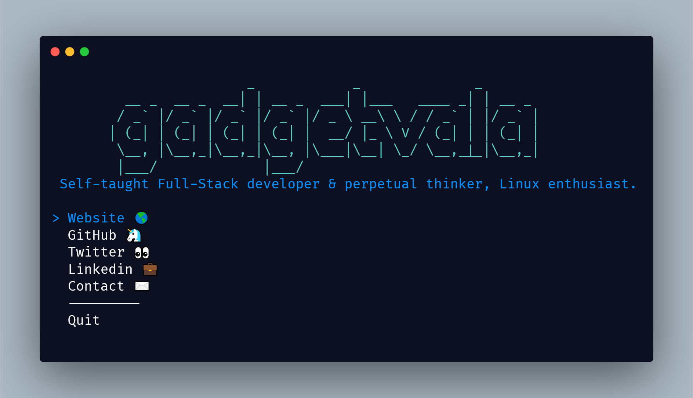

<h1 align="center">gadgetvala</h1>
<p align="center">The <a href="https://gadgetvala.github.io">
    gadgetvala
  </a> CLI</p>
</i>

<div align="center">
  <a href="https://www.linkedin.com/in/gadgetvala/">
    
  </a>
  <a>
    
  </a>
  </a>
  
</div>

# Introduction

> “The gadgetvala CLI”
> is a small, simple cli tools.

Before we start, you can take a look at the app:



## 🚀 &nbsp;Installation & Usages

From your command line:

```bash
# To install
$ npm i -g gadgetvalacli

# To use
$ gadgetvala
```

### Packages

Some very good packages are used in the project, not a big list.
Below are the information about these packages.

| package                                                            | explain                |
| ------------------------------------------------------------------ | ---------------------- |
| [import-jsx](https://www.npmjs.com/package/import-jsx)             | Compile and Render JSX |
| [ink](https://www.npmjs.com/package/ink)                           | React for cli          |
| [ink-select-input](https://www.npmjs.com/package/ink-select-input) | Select User reponse    |
| [meow](https://www.npmjs.com/package/meow)                         | Hepler                 |
| [node-banner](https://www.npmjs.com/package/node-banner)           | Show ASCII Text        |
| [open](https://www.npmjs.com/package/open)                         | To Open Apps           |
| [react](https://pub.dev/packages?q=provider)                       | For Building UI        |

## :clap: Done

Feel free to **file a new issue** with a respective title and description on the the [gadgetvala-cli](https://github.com/gadgetvala/gadgetvala-cli/issues) repository. If you already found a solution to your problem, **I would love to review your pull request**!

## :heart: Contributor

Made by [Suraj Verma](https://github.com/gadgetvala)
